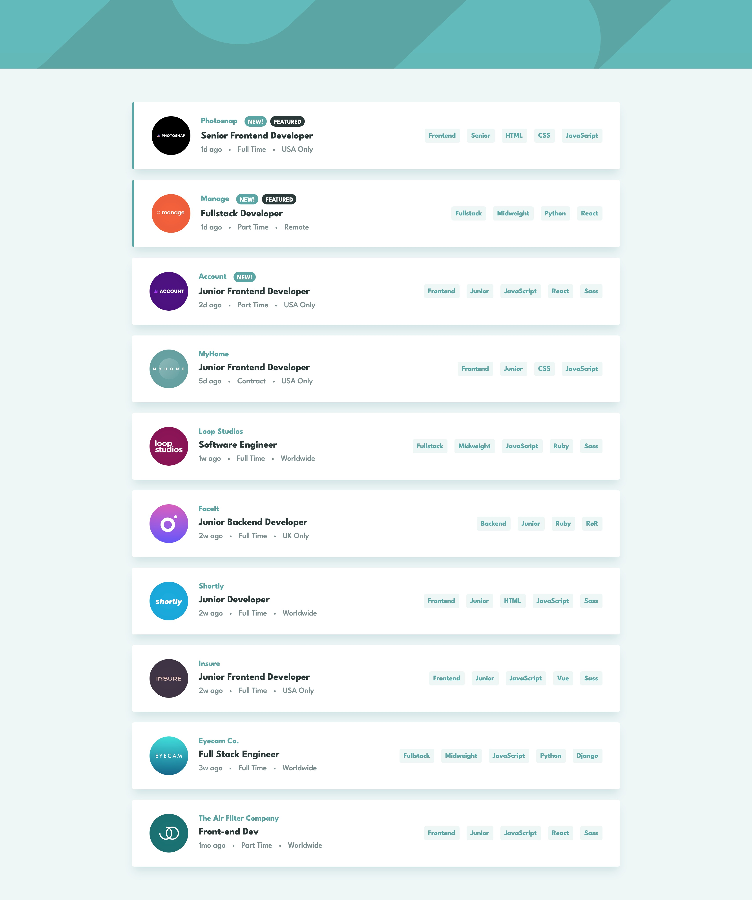

# Frontend Mentor - Job listings with filtering

This is a solution to the [Job listings with filtering challenge on Frontend Mentor](https://www.frontendmentor.io/challenges/job-listings-with-filtering-ivstIPCt)

## Table of contents

- [Overview](#overview)
  - [The challenge](#the-challenge)
  - [Screenshot](#screenshot)
  - [Links](#links)
- [My process](#my-process)
  - [Built with](#built-with)
  - [What I learned](#what-i-learned)
  - [Useful resources](#useful-resources)
- [Author](#author)

## Overview

### The challenge

Users should be able to:

- View the optimal layout for the site depending on their device's screen size
- See hover states for all interactive elements on the page
- Filter job listings based on the categories

### Screenshot



### Links

- Solution URL: [https://github.com/FerdinandoGeografo/job-listings-with-filtering](https://github.com/FerdinandoGeografo/job-listings-with-filtering)
- Live Site URL: [https://fg-job-listings-with-filtering.netlify.app/](https://fg-job-listings-with-filtering.netlify.app/)

## My process

### Built with

- Semantic HTML5 markup
- Css custom properties
- Flexbox
- Mobile-first workflow
- [rxjs](https://rxjs.dev/) - JS library
- [Angular](https://angular.io/docs) - JS framework with TypeScript

### What I learned

While completing this challenge I wanted to focus on implementing category-based job list filtering using rxjs and its main features such as operators and observables.
I wanted to practice on new learned concepts such as a way of thinking in a declarative approach, where possible, instead of the imperative one.
With rxjs it's possible to define data streams by describing them in terms of 'WHAT' they do with our data; from an imperative point of view the focus is on 'HOW' they manipulate the data.
This approach allowed me also to dive deeper into Angular's async pipe which allows us to manage the subscription to observables directly in the template, saving a lot of boilerplate code in the typescript side.
Here is a code snippet that shows a central part of the logic for filtering jobs:

```ts
filteredJobs$ = combineLatest([this.job$, this.categoriesAction$]).pipe(
  map(([jobs, categories]) => {
    if (categories.length === 0) return jobs;
    return jobs.filter((job) => categories.every((cat) => [job.position, job.role, job.level, ...job.languages, ...job.tools].includes(cat)));
  })
);
```

The combineLatest operator is useful with observables that rely on each other for some calculation, and it will not emit an initial value until each observable emit at least one value.
In this example the jobs$ observable is the stream of all jobs retrieved and the categoriesAction$ observable is a BehaviorSubject of
the current categories selected which initially emit an empty array.
Values emitted are then combined in a pipe with the map operator to filter the job array based on current categories selected with this criterion:
each category must be included in the array composed of the properties of a specific job, properties on which the filter is applied such as role, position, languages and tools.

Finally in the template, I can use the async pipe to subscribe to the filteredJob$ stream:

```html
<ul class="jobs-list">
  <li *ngFor="let job of jobs$ | async">
    <!-- Job item -->
  </li>
</ul>
```

Feedbacks and opinions on the realization of this challenge are obviously welcome.

### Useful resources

- [RxJs: Write a creation operator from scratch](https://www.youtube.com/watch?v=_obSErq6fmw&list=PLUioGv_6G9YLjYtrWAZ4ZcFB-YtFueQMv)

- [RxJS in Angular: Terms, Tips, and Patterns](https://www.youtube.com/watch?v=vtCDRiG__D4&t=2019s)

- [The easier way to code Angular apps](https://www.youtube.com/watch?v=skOTEbGwncE)

Concepts related to rxjs streams and operators are not trivial and often controintuitive at first glance. Among the many resources consulted on the web, these videos helped me a lot to understand in greater detail the strategy to adopt and the way of thinking when developing using rxjs.
I strongly recommend these channels as I consider them providers of very high level resources for those who want to learn and improve in front-end development.

## Author

- LinkedIn - [@FerdinandoGeografo](https://www.linkedin.com/in/ferdinandogeografo/)
- GitHub - [@FerdinandoGeografo](https://github.com/FerdinandoGeografo/job-listings-with-filtering)
- Frontend Mentor - [@FerdinandoGeografo](https://www.frontendmentor.io/profile/FerdinandoGeografo)
